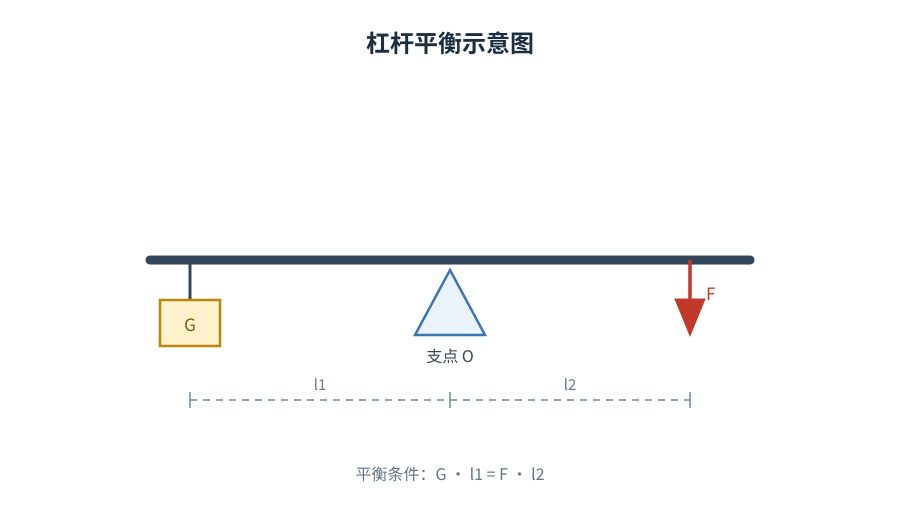
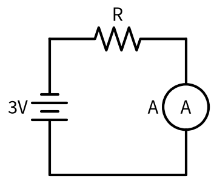
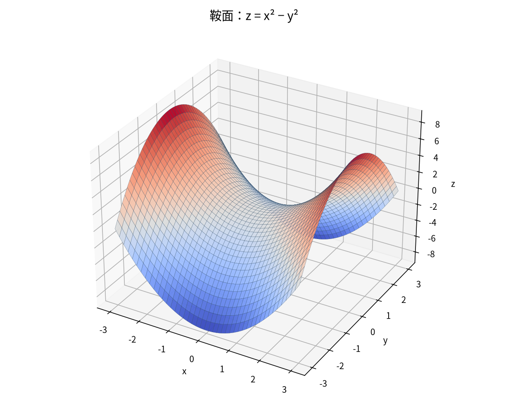

# diagram-sketch（示意图绘制）

为 Operit 打造的示意图工具包：让 AI 在对话中直接绘制 **结构图 / 实验示意图 / 电路图 / 3D 曲面**，输出 PNG 并在对话内即时显示。

> 区别于纯生图：本包走“**代码即图纸**”路线——由结构化源码（DOT / SVG / schemdraw / 数学表达式）渲染，线条、文字、符号精确可控，适合讲解与教学场景。

## 功能

| 工具 | 引擎 | 适用场景 |
|---|---|---|
| `render_dot` | Graphviz | 结构图、流程图、关系图、层级图（自动布局） |
| `render_svg` | librsvg | 实验装置图、几何图形、光路图、结构分解图（自由摆放） |
| `render_circuit` | schemdraw | 电路、电学实验（标准电路符号） |
| `render_3d` | matplotlib 3D | 3D 曲面、参数曲面（球面/环面/柱面）、立体几何 |

## 效果预览

| 结构图 | 实验示意图 |
|---|---|
|  |  |
|  |  |

## 亮点

- **单文件自包含**：两个 Python 引擎（schemdraw / matplotlib3D）的源码内嵌在包内，首次调用自动落盘——无需手动部署任何文件
- Python 解释器自动探测（优先 `~/.venvs/plotter`，否则系统 python3），依赖缺失时给出安装提示
- 输出到应用内部数据区 `Diagrams/`（防误删、随应用数据备份、对话内秒显）
- 执行通道自愈设计（executorKey 自持，遇死会话自动更换）

## 安装

### 1. 系统依赖（按需安装）

```bash
apt-get install -y graphviz librsvg2-bin
python3 -m pip install schemdraw matplotlib numpy
```

> 推荐使用 venv：`python3 -m venv ~/.venvs/plotter && ~/.venvs/plotter/bin/pip install schemdraw matplotlib numpy`（本包会自动探测该解释器）

### 2. 导入包

将 `diagram-sketch-v0.2.1.js` 导入 Operit 并启用即可，无需其他文件。

## 使用

对话中直接说需求即可，AI 会自动选择工具并生成图片：

- 「画一个科举流程图」→ `render_dot`
- 「画一个光的反射示意图」→ `render_svg`
- 「画一个串联电路图」→ `render_circuit`
- 「画一个鞍面 z=x^2-y^2」→ `render_3d`

## 工程细节

- 输出目录：应用内部数据区 `Diagrams/`
- 结构图/示意图走命令行渲染（dot / rsvg-convert）；电路/3D 走内嵌 Python 引擎（首次调用自动落盘到 `files/tools/`）
- 中文渲染：依赖系统 Noto Sans CJK 字体

## License

MIT
